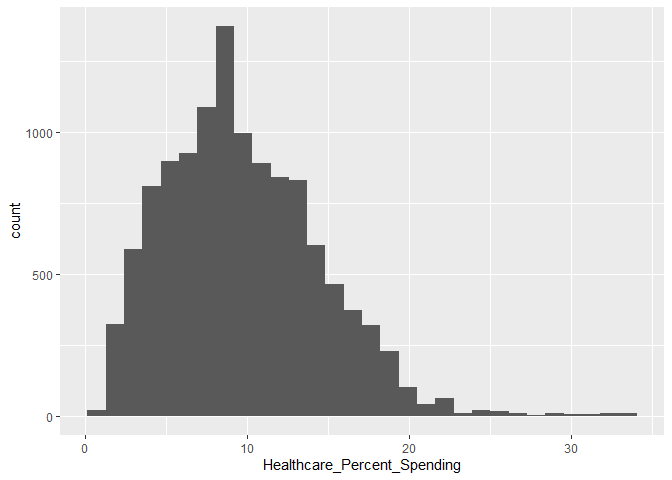
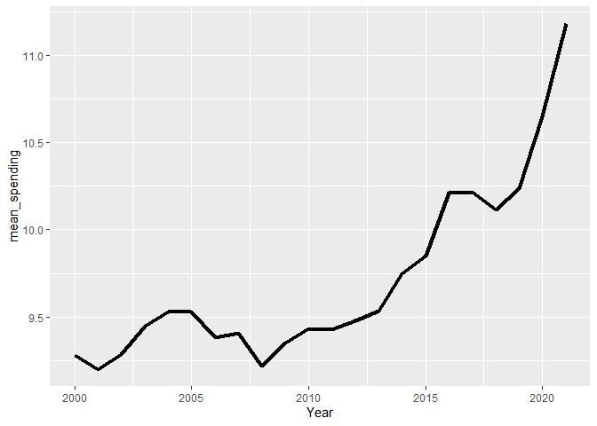

Final EDA
================
2025-11-25

``` r
library(tidyverse)
```

    ## ── Attaching core tidyverse packages ──────────────────────── tidyverse 2.0.0 ──
    ## ✔ dplyr     1.1.4     ✔ readr     2.1.5
    ## ✔ forcats   1.0.0     ✔ stringr   1.5.1
    ## ✔ ggplot2   4.0.0     ✔ tibble    3.3.0
    ## ✔ lubridate 1.9.4     ✔ tidyr     1.3.1
    ## ✔ purrr     1.1.0     
    ## ── Conflicts ────────────────────────────────────────── tidyverse_conflicts() ──
    ## ✖ dplyr::filter() masks stats::filter()
    ## ✖ dplyr::lag()    masks stats::lag()
    ## ℹ Use the conflicted package (<http://conflicted.r-lib.org/>) to force all conflicts to become errors

``` r
spend <- read_csv("Health_Spend.csv")
```

    ## Rows: 4384 Columns: 34
    ## ── Column specification ────────────────────────────────────────────────────────
    ## Delimiter: ","
    ## chr  (10): IndicatorCode, Indicator, ValueType, ParentLocationCode, ParentLo...
    ## dbl   (3): Period, FactValueNumeric, Value
    ## lgl  (20): IsLatestYear, Dim1 type, Dim1, Dim1ValueCode, Dim2 type, Dim2, Di...
    ## dttm  (1): DateModified
    ## 
    ## ℹ Use `spec()` to retrieve the full column specification for this data.
    ## ℹ Specify the column types or set `show_col_types = FALSE` to quiet this message.

``` r
life <- read_csv("Life_Exp.csv")
```

    ## Rows: 24420 Columns: 34
    ## ── Column specification ────────────────────────────────────────────────────────
    ## Delimiter: ","
    ## chr  (14): IndicatorCode, Indicator, ValueType, ParentLocationCode, ParentLo...
    ## dbl   (4): Period, FactValueNumeric, FactValueNumericLow, FactValueNumericHigh
    ## lgl  (15): IsLatestYear, Dim2 type, Dim2, Dim2ValueCode, Dim3 type, Dim3, Di...
    ## dttm  (1): DateModified
    ## 
    ## ℹ Use `spec()` to retrieve the full column specification for this data.
    ## ℹ Specify the column types or set `show_col_types = FALSE` to quiet this message.

``` r
life_clean <- life %>%
  select(Indicator, ParentLocation, SpatialDimValueCode, Location, Period, Dim1, FactValueNumeric)
```

``` r
life_clean <- life_clean %>%
  rename(Region = ParentLocation,
         CountryCode = SpatialDimValueCode,
         Country = Location, 
         Year = Period,
         Gender = Dim1,
         Life_Expectancy = FactValueNumeric)
```

``` r
life_clean <- life_clean %>%
  filter(Indicator == "Life expectancy at birth (years)")
```

``` r
spend_clean <- spend %>%
  select(ParentLocation, SpatialDimValueCode, Location, Period, FactValueNumeric)
```

``` r
spend_clean <- spend_clean %>%
  rename(Region = ParentLocation,
         CountryCode = SpatialDimValueCode,
         Country = Location, 
         Year = Period,
         Healthcare_Percent_Spending = FactValueNumeric)
```

``` r
spend_clean <- spend_clean %>%
  filter(Year < 2022)
```

``` r
df <- life_clean %>%
  left_join(spend_clean, by = c("Region", "CountryCode", "Country", "Year"))
```

# Took in both data sets, selected just the variables of interest, cleaned the names to be easier to understand, then joined the datasets into one data frame.

``` r
summary(df)
```

    ##   Indicator            Region          CountryCode          Country         
    ##  Length:12210       Length:12210       Length:12210       Length:12210      
    ##  Class :character   Class :character   Class :character   Class :character  
    ##  Mode  :character   Mode  :character   Mode  :character   Mode  :character  
    ##                                                                             
    ##                                                                             
    ##                                                                             
    ##                                                                             
    ##       Year         Gender          Life_Expectancy Healthcare_Percent_Spending
    ##  Min.   :2000   Length:12210       Min.   :36.60   Min.   : 0.730             
    ##  1st Qu.:2005   Class :character   1st Qu.:64.19   1st Qu.: 6.310             
    ##  Median :2010   Mode  :character   Median :71.87   Median : 9.070             
    ##  Mean   :2010                      Mean   :70.17   Mean   : 9.721             
    ##  3rd Qu.:2016                      3rd Qu.:77.09   3rd Qu.:12.790             
    ##  Max.   :2021                      Max.   :87.37   Max.   :33.470             
    ##                                                    NA's   :363

``` r
colSums(is.na(df))
```

    ##                   Indicator                      Region 
    ##                           0                           0 
    ##                 CountryCode                     Country 
    ##                           0                           0 
    ##                        Year                      Gender 
    ##                           0                           0 
    ##             Life_Expectancy Healthcare_Percent_Spending 
    ##                           0                         363

``` r
df %>% filter(is.na(Healthcare_Percent_Spending))
```

    ## # A tibble: 363 × 8
    ##    Indicator             Region CountryCode Country  Year Gender Life_Expectancy
    ##    <chr>                 <chr>  <chr>       <chr>   <dbl> <chr>            <dbl>
    ##  1 Life expectancy at b… South… PRK         Democr…  2021 Male              69.8
    ##  2 Life expectancy at b… South… PRK         Democr…  2021 Both …            72.6
    ##  3 Life expectancy at b… South… PRK         Democr…  2021 Female            75.6
    ##  4 Life expectancy at b… Ameri… PRI         Puerto…  2021 Male              76.2
    ##  5 Life expectancy at b… Ameri… PRI         Puerto…  2021 Both …            79.9
    ##  6 Life expectancy at b… Ameri… PRI         Puerto…  2021 Female            83.5
    ##  7 Life expectancy at b… South… PRK         Democr…  2020 Male              69.3
    ##  8 Life expectancy at b… South… PRK         Democr…  2020 Both …            72.4
    ##  9 Life expectancy at b… South… PRK         Democr…  2020 Female            75.5
    ## 10 Life expectancy at b… Ameri… PRI         Puerto…  2020 Male              76.1
    ## # ℹ 353 more rows
    ## # ℹ 1 more variable: Healthcare_Percent_Spending <dbl>

# Will just leave in NA values as they are real missing data, and the rows still have useful information on Life Expectancy.

``` r
ggplot(df, aes(Life_Expectancy)) + 
  geom_histogram(na.rm = TRUE)
```

    ## `stat_bin()` using `bins = 30`. Pick better value `binwidth`.

<!-- -->

``` r
ggplot(df, aes(Healthcare_Percent_Spending)) + 
  geom_histogram(na.rm = TRUE)
```

    ## `stat_bin()` using `bins = 30`. Pick better value `binwidth`.

<!-- -->

``` r
ggplot(df, aes(x = Healthcare_Percent_Spending, y = Life_Expectancy)) +
  geom_point(na.rm = TRUE) +
  geom_smooth(method = "lm", se = FALSE, color = "red")
```

    ## `geom_smooth()` using formula = 'y ~ x'

    ## Warning: Removed 363 rows containing non-finite outside the scale range
    ## (`stat_smooth()`).

<!-- -->

``` r
library(corrplot)
```

    ## corrplot 0.95 loaded

``` r
numerical <- df %>%
  select(where(is.numeric))

corr <- cor(numerical, use = "pairwise.complete.obs")

corrplot(corr)
```

<!-- --> \# We
can see that Life Expectancy and Healthcare Spending are positively
correlated with each other. There is a small positive correlation with
Year and Life Expectancy showing that we having been increasing life
expectancy slightly.

``` r
df %>%
  group_by(Gender) %>%
  summarise(mean_life = mean(Life_Expectancy)) %>%
  ggplot(aes(x = Gender, y = mean_life, fill = Gender)) + 
  geom_col()
```

<!-- --> \#
Females tend to have higher life expectancy.

``` r
df %>%
  group_by(Year, Gender) %>%
  summarise(mean_life = mean(Life_Expectancy)) %>%
  ggplot(aes(x = Year, y = mean_life, color = Gender)) + 
  geom_line(size = 1.5)
```

    ## `summarise()` has grouped output by 'Year'. You can override using the
    ## `.groups` argument.

    ## Warning: Using `size` aesthetic for lines was deprecated in ggplot2 3.4.0.
    ## ℹ Please use `linewidth` instead.
    ## This warning is displayed once every 8 hours.
    ## Call `lifecycle::last_lifecycle_warnings()` to see where this warning was
    ## generated.

<!-- --> \# It
looks like we have taking a downturn in life expectancy in the last few
years.

``` r
df %>%
  group_by(Year) %>%
  summarise(mean_spending = mean(Healthcare_Percent_Spending, na.rm = TRUE)) %>%
  ggplot(aes(x = Year, y = mean_spending)) +
  geom_line(size = 1.5)
```

<!-- --> \#
Spending on healthcare has been increasing over the years, likely
helping to increase overall life expectancy.

``` r
ggplot(df, aes(x = Gender, y = Life_Expectancy)) +
  geom_boxplot()
```

<!-- -->

``` r
write_csv(df, "clean_life.csv")
```

