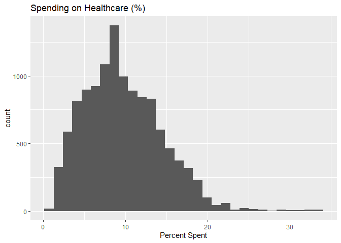
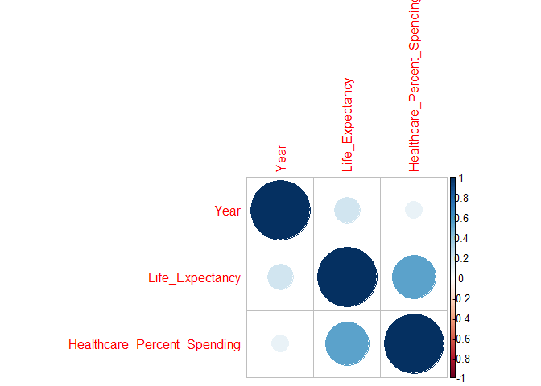
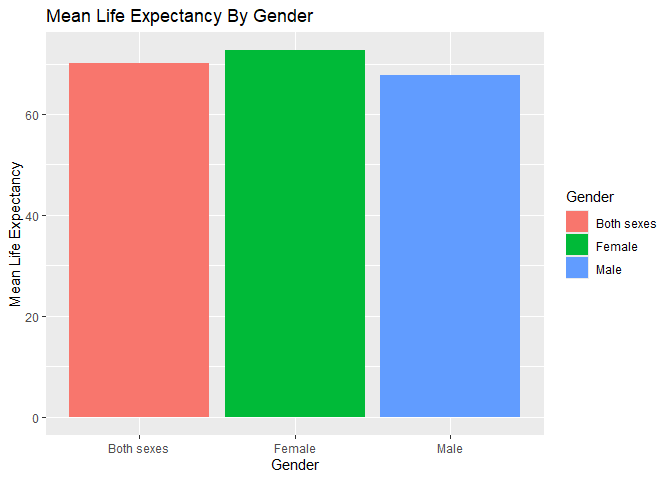
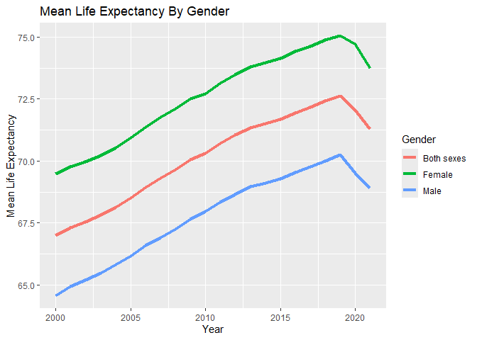
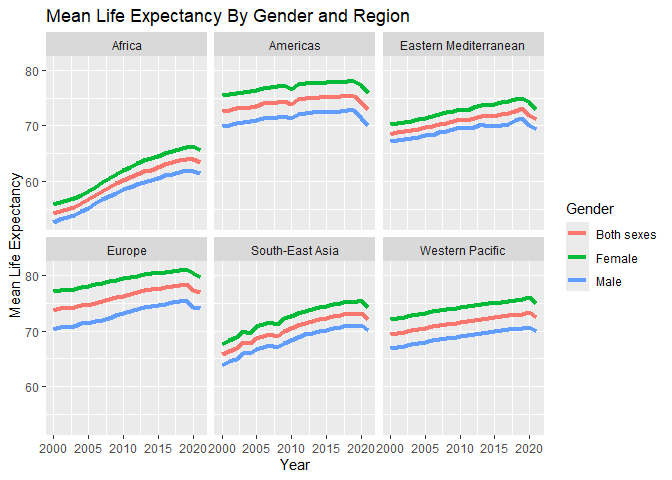
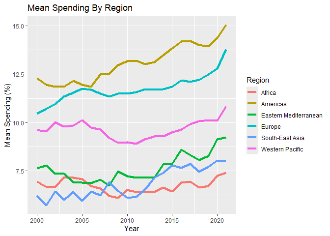
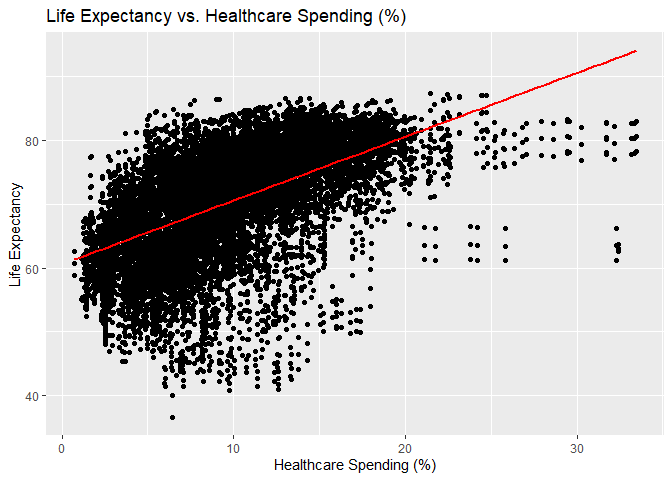
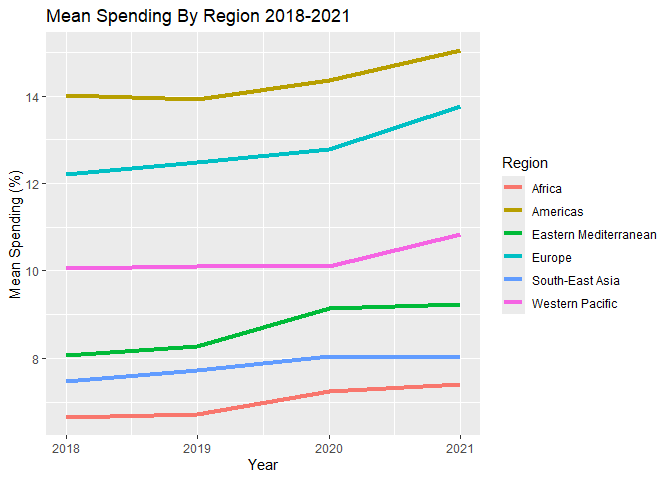
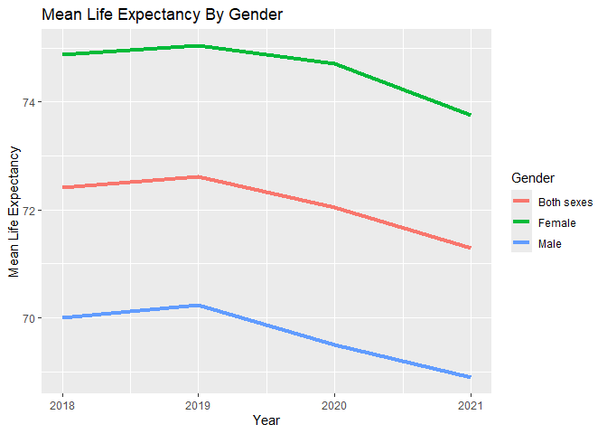

EDA & Report
================
2025-11-25

``` r
library(tidyverse)
```

    ## ── Attaching core tidyverse packages ──────────────────────── tidyverse 2.0.0 ──
    ## ✔ dplyr     1.1.4     ✔ readr     2.1.5
    ## ✔ forcats   1.0.0     ✔ stringr   1.5.1
    ## ✔ ggplot2   4.0.0     ✔ tibble    3.3.0
    ## ✔ lubridate 1.9.4     ✔ tidyr     1.3.1
    ## ✔ purrr     1.1.0     
    ## ── Conflicts ────────────────────────────────────────── tidyverse_conflicts() ──
    ## ✖ dplyr::filter() masks stats::filter()
    ## ✖ dplyr::lag()    masks stats::lag()
    ## ℹ Use the conflicted package (<http://conflicted.r-lib.org/>) to force all conflicts to become errors

``` r
df <- read_csv("clean_life.csv")
```

    ## Rows: 12210 Columns: 8
    ## ── Column specification ────────────────────────────────────────────────────────
    ## Delimiter: ","
    ## chr (5): Indicator, Region, CountryCode, Country, Gender
    ## dbl (3): Year, Life_Expectancy, Healthcare_Percent_Spending
    ## 
    ## ℹ Use `spec()` to retrieve the full column specification for this data.
    ## ℹ Specify the column types or set `show_col_types = FALSE` to quiet this message.

# Introduction

In this report we will be looking at data from the World Health
Organization. I took two data sets from their website, one related to
life expectancy and the other is looking at domestic general government
health expenditure (GGHE-D) as a percentage of general government
expenditure (GGE). In short that is looking at what percent of total
government spending is spent on healthcare.

I want to look and see the changes across time for different countries
and regions when related to life expectancy, and to see if a higher
percent of government spending is correlated with higher life
expectancy. I will also look at gender differences when it comes to life
expectancy and we will look at if their are different regions in the
world where men are higher than women or not and speculate why that may
be.

This research is significant as we will be able to tell that if
countries improve their percent of spending on healthcare, they may be
able to raise the life expectancy of their citizens, as well as if it
could level out any differences when related to gender on life
expectancy.

# Data Cleaning

I took steps to clean the data by removing some of the clutter in the
data sets and slimming it down to just the variables that matter to us.
I also renamed the columns for a more clear picture of what the variable
is including. The data was overall very clean and the only NA values
left in the data were about 350 out of the 12,210 rows. All of the NA
values were in the healthcare spending column, where the country did not
report the levels. Each of these data sets include data from 2000-2021.

# EDA & Analysis

``` r
ggplot(df, aes(Life_Expectancy)) + 
  geom_histogram(na.rm = TRUE) +
  labs(title = "Life Expectancy",
       x = "Life Expectancy")
```

    ## `stat_bin()` using `bins = 30`. Pick better value `binwidth`.

<!-- -->

``` r
ggplot(df, aes(Healthcare_Percent_Spending)) + 
  geom_histogram(na.rm = TRUE) +
  labs(title = "Spending on Healthcare (%)",
       x = "Percent Spent")
```

    ## `stat_bin()` using `bins = 30`. Pick better value `binwidth`.

<!-- -->

These two histograms show us the trends of healthcare spending and life
expectancy. We see where the majoity of data points lie, and see if
there is any outlandish skewness. Both graphs seem good and data
wouldn’t need to be transformed.

``` r
library(corrplot)
```

    ## corrplot 0.95 loaded

``` r
numerical <- df %>%
  select(where(is.numeric))

corr <- cor(numerical, use = "pairwise.complete.obs")

corrplot(corr)
```

<!-- -->

# We can see that Life Expectancy and Healthcare Spending are positively correlated with each other. There is a small positive correlation with Year and Life Expectancy showing that we having been increasing life expectancy slightly.

``` r
df %>%
  group_by(Gender) %>%
  summarise(mean_life = mean(Life_Expectancy)) %>%
  ggplot(aes(x = Gender, y = mean_life, fill = Gender)) + 
  geom_col() +
  labs(title = "Mean Life Expectancy By Gender",
       y = "Mean Life Expectancy")
```

<!-- -->

``` r
df %>%
  group_by(Year, Gender) %>%
  summarise(mean_life = mean(Life_Expectancy)) %>%
  ggplot(aes(x = Year, y = mean_life, color = Gender)) + 
  geom_line(size = 1.5) +
  labs(title = "Mean Life Expectancy By Gender",
       y = "Mean Life Expectancy")
```

    ## `summarise()` has grouped output by 'Year'. You can override using the
    ## `.groups` argument.

    ## Warning: Using `size` aesthetic for lines was deprecated in ggplot2 3.4.0.
    ## ℹ Please use `linewidth` instead.
    ## This warning is displayed once every 8 hours.
    ## Call `lifecycle::last_lifecycle_warnings()` to see where this warning was
    ## generated.

<!-- -->

``` r
df %>%
  group_by(Year, Gender, Region) %>%
  summarise(mean_life = mean(Life_Expectancy)) %>%
  ggplot(aes(x = Year, y = mean_life, color = Gender)) + 
  geom_line(size = 1.5) +
  facet_wrap(~ Region) +
  labs(title = "Mean Life Expectancy By Gender and Region",
       y = "Mean Life Expectancy")
```

    ## `summarise()` has grouped output by 'Year', 'Gender'. You can override using
    ## the `.groups` argument.

<!-- -->

From these three plots we can see that Females typically have higher
life expectancy, however all genders have had a downtrend as of the last
few years. This holds true across all regions.

``` r
df %>%
  group_by(Year) %>%
  summarise(mean_spending = mean(Healthcare_Percent_Spending, na.rm = TRUE)) %>%
  ggplot(aes(x = Year, y = mean_spending)) +
  geom_line(size = 1.5) +
  labs(title = "Mean Spending By Year",
       y = "Mean Spending")
```

<!-- -->

``` r
df %>%
  group_by(Year, Region) %>%
  summarise(mean_spending = mean(Healthcare_Percent_Spending, na.rm = TRUE)) %>%
  ggplot(aes(x = Year, y = mean_spending, color = Region)) +
  geom_line(size = 1.5) +
  labs(title = "Mean Spending By Region",
       y = "Mean Spending (%)")
```

    ## `summarise()` has grouped output by 'Year'. You can override using the
    ## `.groups` argument.

<!-- -->

``` r
df %>%
  group_by(Year, Region) %>%
  summarise(mean_life = mean(Life_Expectancy)) %>%
  ggplot(aes(x = Year, y = mean_life, color = Region)) + 
  geom_line(size = 1.5) +
  labs(title = "Mean Life Expectancy By Region",
  y = "Mean Life Expectancy")
```

    ## `summarise()` has grouped output by 'Year'. You can override using the
    ## `.groups` argument.

<!-- -->

# We can use the two above charts to see some of the differences between the regions when it comes to life expectancy or spending on healthcare. African countries have shown a good increase on life expectancy, however they are still lacking behind other regions by quite a large margin.

``` r
ggplot(df, aes(x = Gender, y = Life_Expectancy)) +
  geom_boxplot() +
  labs(title = "Mean Life Expectancy By Gender",
  y = "Mean Life Expectancy")
```

<!-- -->

# We can see here that while females have a higher life expectancy overall, there are some outliers that places them even lower than males.

``` r
ggplot(df, aes(x = Healthcare_Percent_Spending, y = Life_Expectancy)) +
  geom_point(na.rm = TRUE) +
  geom_smooth(method = "lm", se = FALSE, color = "red") +
  labs(title = "Life Expectancy vs. Healthcare Spending (%)",
       y = "Life Expectancy",
       x = "Healthcare Spending (%)")
```

    ## `geom_smooth()` using formula = 'y ~ x'

    ## Warning: Removed 363 rows containing non-finite outside the scale range
    ## (`stat_smooth()`).

<!-- --> \#
With this graph we can see that there is a positive trend between life
expectancy and healthcare spending, showing that as one increases, it is
likely the other does as well.

``` r
df_late <- df %>%
  filter(Year >= 2018)
```

``` r
ggplot(df_late, aes(x = Healthcare_Percent_Spending, y = Life_Expectancy)) +
  geom_point(na.rm = TRUE) +
  geom_smooth(method = "lm", se = FALSE, color = "red") +
  labs(title = "Life Expectancy vs. Healthcare Spending (%) 2018 - 2021",
       y = "Life Expectancy",
       x = "Healthcare Spending (%)")
```

    ## `geom_smooth()` using formula = 'y ~ x'

    ## Warning: Removed 24 rows containing non-finite outside the scale range
    ## (`stat_smooth()`).

<!-- -->

# Even though life expectancy has decreased from 2018 - 2021 we still see a positive trend in relation to healthcare spending.

``` r
df_late %>%
  group_by(Year, Region) %>%
  summarise(mean_life = mean(Life_Expectancy)) %>%
  ggplot(aes(x = Year, y = mean_life, color = Region)) + 
  geom_line(size = 1.5) +
  labs(title = "Mean Life Expectancy By Region 2018-2021",
  y = "Mean Life Expectancy")
```

    ## `summarise()` has grouped output by 'Year'. You can override using the
    ## `.groups` argument.

<!-- -->

``` r
df_late %>%
  group_by(Year, Region) %>%
  summarise(mean_spending = mean(Healthcare_Percent_Spending, na.rm = TRUE)) %>%
  ggplot(aes(x = Year, y = mean_spending, color = Region)) +
  geom_line(size = 1.5) +
  labs(title = "Mean Spending By Region 2018-2021",
       y = "Mean Spending (%)")
```

    ## `summarise()` has grouped output by 'Year'. You can override using the
    ## `.groups` argument.

<!-- -->

``` r
df_late %>%
  group_by(Year) %>%
  summarise(mean_life = mean(Life_Expectancy)) %>%
  ggplot(aes(x = Year, y = mean_life)) + 
  geom_line(size = 1.5) +
  labs(title = "Mean Life Expectancy 2018-2021",
       y = "Mean Life Expectancy")
```

<!-- -->

``` r
df_late %>%
  group_by(Year, Gender) %>%
  summarise(mean_life = mean(Life_Expectancy)) %>%
  ggplot(aes(x = Year, y = mean_life, color = Gender)) + 
  geom_line(size = 1.5) +
  labs(title = "Mean Life Expectancy By Gender",
       y = "Mean Life Expectancy")
```

    ## `summarise()` has grouped output by 'Year'. You can override using the
    ## `.groups` argument.

<!-- -->

``` r
fit_lm <- lm(Life_Expectancy ~ Healthcare_Percent_Spending, data = df)
summary(fit_lm)
```

    ## 
    ## Call:
    ## lm(formula = Life_Expectancy ~ Healthcare_Percent_Spending, data = df)
    ## 
    ## Residuals:
    ##     Min      1Q  Median      3Q     Max 
    ## -32.322  -4.155   1.303   5.172  18.473 
    ## 
    ## Coefficients:
    ##                             Estimate Std. Error t value Pr(>|t|)    
    ## (Intercept)                 60.57199    0.15515  390.41   <2e-16 ***
    ## Healthcare_Percent_Spending  1.00083    0.01435   69.74   <2e-16 ***
    ## ---
    ## Signif. codes:  0 '***' 0.001 '**' 0.01 '*' 0.05 '.' 0.1 ' ' 1
    ## 
    ## Residual standard error: 7.39 on 11845 degrees of freedom
    ##   (363 observations deleted due to missingness)
    ## Multiple R-squared:  0.2911, Adjusted R-squared:  0.291 
    ## F-statistic:  4864 on 1 and 11845 DF,  p-value: < 2.2e-16

# This linear regression summary shows that for every 1 percent increase in Healthcare Spending, we will see about a 1 year increase in life expectancy. It is showing a very signficant relationship based on the very small P value. This model shows about 29 percent of the variation in life expectancy.

# Conclusion

Life expectancy has generally increased over the last 21 years, however
there has been a decrease in life expectancy over the last few years.
However, there was no visible decrease in healthcare spending that would
match the decrease of life expectancy. We can also see that a gender
difference has stayed fairly constant over the years with women tending
to outlive men.

We can see from the results from the linear regression that spending a
larger percent of money from overall government spending will likely
lead to an increase in life expectancy for a countries population. While
this is not the only factor for altering life expectancy, it does show
about 29& of the variation for life expectancy. We can see that other
factors must also be involved in determining this. This is shown by
while the Americas have the highest healthcare spending, they do not
have the highest life expectancy among regions.

In summary, spending more of the government spending budget on
healthcare usually leads to an increase in life expectancy. There are
other factors at play though such as regional and gender differences,
however it remains true that more spending on healthcare will usually
have a positive effect on life expectancy.

Next steps would be to conduct research on reasons why life expectancy
has been decreasing in previous years. Some potential topics to explore
could be: Healthcare has increased in cost to the point where the amount
spent by the government is not keeping pace with the price. Healthcare
quality could of decreased leading to worse health outcomes. Other
aspects of life have changed causing an decrease in life expectancy
(Health Issues, Lack/Surplus of food intake, Conflict). We could also
look at other health conditions such as cancer, obesity, heart disease
rates and see if they have been increasing, and if modern medicine/
medical staffing is not up to par to handle the influx of so many cases.

